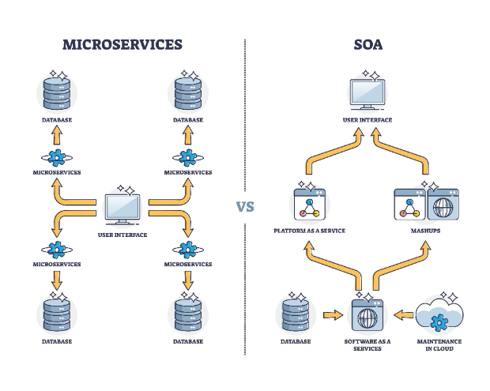

# **Secure Messaging System**

Welcome to the Action/Intention secure messaging platform. This project is a complete, production-grade microservices ecosystem designed for end-to-end encrypted communication. It features a modern Angular frontend, a central identity provider, and a fleet of backend services written in Go and Node.js that handle real-time message routing, key management, and push notifications.

The architecture is designed to be secure, scalable, and resilient, leveraging technologies like Google Cloud Pub/Sub, Firestore, JWTs, and WebSockets.

## **At a Glance: The Core Components**

The system is composed of several independent services that work together.

* **Angular Frontend**: The user interface. This is where users log in, manage contacts, and send/receive messages. All encryption and decryption happens here on the client-side.
* **Identity Service** (Node.js): The "passport control" for the entire system. It handles user login via Google, verifies that a user is authorized, and issues the security tokens (JWTs) that grant access to all other services.
* **Key Service** (Go): A secure vault that stores users' public encryption keys. When you want to send a message to someone, the app fetches their public key from this service.
* **Messaging Service** (Node.js): Manages user-specific data, primarily the user's address book or contact list.
* **Routing Service** (Go): The "central post office" and real-time hub. It intelligently routes messages to users who are online (via WebSockets) and stores messages for users who are offline.
* **Notification Service** (Go): A background worker that sends push notifications (e.g., to an iPhone or Android device) when a message arrives for a user who is offline.

## **How It Works: The Short Version**

If you're new to the system, these two stories explain the core user flows in simple terms.

### **The First Login (Alice's Story)**

1. **Alice Clicks Login**: Alice opens the web app and clicks "Login with Google."
2. **Passport Control**: She is sent to the **Identity Service**, which redirects her to Google. After she signs in, Google sends her back. The Identity Service checks its own database to make sure Alice is an authorized user.
3. **Getting the "Key Card"**: Since Alice is authorized, the Identity Service gives her browser a special, short-lived digital "key card" (a JWT).
4. **Access Granted**: Alice is redirected back to the main application, now logged in. Her browser will show this "key card" to every other service to prove who she is.

### **Sending a Secure Message (Alice to Bob)**

1. **Alice Writes a Message**: Alice writes "Hello, Bob\!" in the app.
2. **Get Bob's Public Lockbox**: The app asks the **Key Service** for Bob's public "lockbox" (his public key).
3. **Lock the Message**: Alice's browser uses Bob's public lockbox to encrypt the message. Now, only Bob can open it with his private key.
4. **Send to the Post Office**: The encrypted message is sent to the **Routing Service**.
5. **Is Bob Online?**: The Routing Service checks if Bob is currently using the app.
    * **If Bob is ONLINE**: The message is sent directly to his app over a real-time connection. His app uses his private key (stored only on his device) to unlock and read the message.
    * **If Bob is OFFLINE**: The Routing Service stores the encrypted message and tells the **Notification Service** to send a "You have a new message\!" push notification to Bob's phone. The next time Bob opens the app, it will fetch the encrypted message and decrypt it.

## **Documentation Hub**

This repository contains the full source code for all services. For a comprehensive understanding of the system's architecture, development setup, and operational guides, please refer to the core documentation.

* [**System Architecture Overview**](docs/architecture.md): The single source of truth for the system's design, component responsibilities, and data flows. **Start here.**
* [**Developer Getting Started Guide**](docs/developer.md): A practical, step-by-step tutorial to get a new developer from a fresh git clone to a fully running local environment.
* [**API Reference**](docs/api.md): A clear, concise reference for all public HTTP endpoints exposed by the system.
* [**Deployment Guide**](docs/deployment.md): A handbook for deploying the system to a production environment.
* [**Shared Libraries Guide**](docs/shared_libs.md): Documentation for the critical shared code, such as the Protobuf schemas and base microservice libraries.